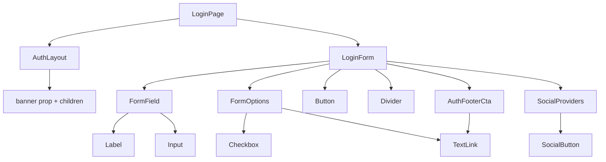

# Página de Login (Atomic Design)

Preparar a infra do `apps/react-app` (Tailwind v4, Vitest + Testing Library, react-router) e construir a tela de login em Atomic Design, com um template de autenticação reutilizável para a futura página de cadastro.

## Todos

- [ ] **infra**: Instalar Tailwind v4, Vitest + Testing Library e react-router em `apps/react-app`; configurar `vite.config.ts`, setup de testes e scripts
- [ ] **tokens**: Reescrever `index.css` com `@import 'tailwindcss'` e tokens do design; remover boilerplate do template (`App.css`, assets e `icons.svg`) e ajustar `index.html`
- [ ] **routes**: Configurar rotas em `App.tsx`: `/login`, `/cadastro` placeholder e redirect de `/`
- [ ] **atoms**: Criar atoms `Button`, `Input`, `Label`, `Checkbox`, `Divider` e `TextLink` com testes
- [ ] **molecules**: Criar molecules `FormField`, `FormOptions`, `SocialButton`, `SocialProviders` e `AuthFooterCta` com testes
- [ ] **organism**: Criar organism `LoginForm` com hook `useLoginForm` (estado, remember e validação) e testes
- [ ] **template**: Criar template `AuthLayout` com banner por prop e children, responsivo, com teste
- [ ] **pages**: Criar `LoginPage` usando `AuthLayout` + `LoginForm` e `SignUpPage` placeholder, com testes
- [ ] **verify**: Rodar test, lint e build do react-app e corrigir pendências

## Contexto

O `apps/react-app` ainda é o template puro do Vite: sem Tailwind, sem testes, sem `src/components`, sem router. As regras do projeto exigem Tailwind e um teste ao lado de cada componente, então a primeira etapa é infra.

Imagens já estão em `public/`, logo são referenciadas por URL absoluta: `/banner.png`, `/github.png`, `/gmail.png`.

## 1. Infra e limpeza

Instalar em `apps/react-app` (pnpm, conforme regra do monorepo):

- runtime: `react-router`
- dev: `tailwindcss`, `@tailwindcss/vite`, `vitest`, `jsdom`, `@testing-library/react`, `@testing-library/user-event`, `@testing-library/jest-dom`

Ajustes:

- [apps/react-app/vite.config.ts](../apps/react-app/vite.config.ts): adicionar plugin `tailwindcss()` e bloco `test` (`environment: 'jsdom'`, `setupFiles: ['./src/test/setup.ts']`).
- `src/test/setup.ts` novo, com `import '@testing-library/jest-dom/vitest'`.
- [apps/react-app/package.json](../apps/react-app/package.json): scripts `test` e `test:watch` (`vitest run` / `vitest`).
- [apps/react-app/src/index.css](../apps/react-app/src/index.css): substituir o CSS do template por `@import 'tailwindcss'` + `@theme` com os tokens do design (fundo `#121214`, card `#202024`, verde `#7ff28c`, input cinza `#8d8d8d`, texto branco) e reset mínimo no `body`.
- Remover boilerplate: `src/App.css`, `src/assets/{hero.png,react.svg,vite.svg}`, `public/icons.svg`; [apps/react-app/src/App.tsx](../apps/react-app/src/App.tsx) passa a montar apenas as rotas.
- [apps/react-app/index.html](../apps/react-app/index.html): `lang="pt-BR"` e `<title>Code Connect</title>`.

Rotas em `App.tsx`: `BrowserRouter` com `/login` (LoginPage), `/cadastro` (placeholder usando o mesmo template) e `/` redirecionando para `/login`.

## 2. Árvore de componentes

`src/components/`:

- **atoms**: `Button` (verde, largura total, seta opcional, variante `type`), `Input`, `Label`, `Checkbox` (marcado com check verde), `Divider` (linhas laterais + texto opcional), `TextLink` (wrapper do `Link` do react-router, com variantes branco sublinhado e verde).
- **molecules**: `FormField` (Label + Input + mensagem de erro, id gerado com `useId`), `FormOptions` ("Lembrar-me" + "Esqueci a senha"), `SocialButton` (imagem + legenda abaixo), `SocialProviders` (Github e Gmail lado a lado), `AuthFooterCta` (texto + link, textos via props para servir ao cadastro).
- **organisms**: `LoginForm` — recebe `onSubmit` e usa o hook `useLoginForm` (`src/hooks/useLoginForm.ts`) para estado dos campos, `remember` e validação simples de obrigatoriedade. Sem chamada de API: o backend Nest ainda não tem endpoint de auth, então o submit só chama o callback.
- **templates**: `AuthLayout` — card escuro arredondado centralizado, grid de duas colunas com `banner: { src, alt }` por prop e `children` na coluna direita; em telas pequenas o banner é escondido e o formulário ocupa a largura toda. É o ponto de reuso do cadastro.
- **pages**: `LoginPage` (título "Login", subtítulo "Boas-vindas! Faça seu login.", banner `/banner.png`) e `SignUpPage` mínima só para a rota existir.

## 3. Testes

Um `Foo.test.tsx` ao lado de cada componente, cobrindo o uso essencial:

- `Button`: renderiza o rótulo e dispara `onClick`.
- `Input`/`Checkbox`: refletem valor e disparam mudança.
- `FormField`: associa label ao input (`getByLabelText`) e exibe erro.
- `SocialProviders`: renderiza os dois provedores com `alt` correto.
- `LoginForm`: preencher os campos e submeter chama `onSubmit` com os valores; submit vazio mostra erro e não chama.
- `AuthLayout`/`LoginPage`: banner com o `src` esperado e conteúdo renderizado (dentro de `MemoryRouter`).

## 4. Verificação

`pnpm --filter ./apps/react-app test`, `pnpm --filter ./apps/react-app lint` e `pnpm build:react`.
